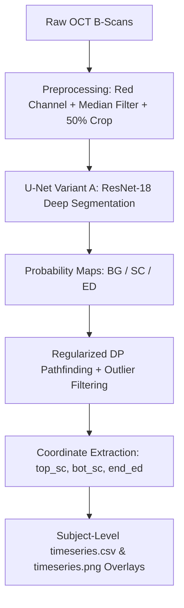

# OCT Skin Layer Analyzer v2.3.0

[](https://www.mathworks.com/products/matlab.html)
[](https://github.com/Corneliox/OCT_Analyzer/releases)
[]()
[]()

> **High-throughput, GPU-accelerated desktop application and automated analysis pipeline for skin optical coherence tomography (OCT) B-scan segmentation, dynamic thickness tracking, and unattended multi-subject batch processing.**

---

## ✨ What's New in v2.3.0

* 🛡️ **Robust Hierarchy & Timestamp Parsing (Zero False Positives):**
  * Patched directory crawler regex (`_(\d+)(?:\.[a-zA-Z]+)?$`) to safely handle decimal-dot timestamps (e.g. `1_30_after_11.33` or `run_14.50`) without mistakenly treating them as scan indices or file extensions.
  * Added strict non-directory file verification (`~[d.isdir]`) to ensure raw scan folders (e.g., `MMode_0.bin/`) are never mistaken for image files.
  * Guarantees flawless end-to-end traversal from top Master Root (`oct ica/`) down through Subject folders (`bayu/`, `azmi/`) directly into Protocol runs.
* 🎯 **100% Legacy Pipeline Compatibility (Richard V1 Preserved):**
  * All primary analysis outputs (`timeseries.csv` and `timeseries.png`) are saved **strictly inside the protocol directory** as `<protocol>_analysis/`, ensuring full backward compatibility with all downstream scripts.
  * Intermediate raw `_out` segmentation caches are preserved and automatically reused.
* 🌲 **Universal Top-Folder Crawler & Dual-Save Export:**
  * Select any top folder level: Master Study (`oct ica/`), individual Subject (`azmi/`), or single Protocol (`1_30_after/`).
  * The crawler automatically identifies every protocol run across all subjects and executes them in sequence.
  * Optionally mirrors outputs into `<subject>_analysis/` for quick subject-wide comparisons without cluttering.
* 🛡️ **Spike-Free Epidermis (`end ED`) Extraction:**
  * Re-engineered Dynamic Programming (DP) with curvature regularization and Hampel/Savitzky-Golay outlier filtering eliminates vertical spikes on both B-scans and time-series plots.
* 🖥️ **Responsive High-DPI UI (Windows 10 & 11 Compatible):**
  * Built with responsive `uigridlayout`, native Segoe UI typography, and auto-expanding progress console.

---

## 📂 Supported Directory Structure

```text
oct ica/                           <-- [Select this or any folder in the App]
├── azmi/
│   ├── 1_30_after/
│   │   ├── raw_..._MMode_0.bin/   (raw scan data)
│   │   └── raw_..._MMode_0.bin_out/ (segmentation cache)
│   ├── 1_30_after_analysis/       <-- [PRIMARY V1 OUTPUT: timeseries.csv & .png]
│   ├── 1_30_before/
│   └── 1_30_before_analysis/      <-- [PRIMARY V1 OUTPUT: timeseries.csv & .png]
│
├── azmi_analysis/                 <-- [MIRRORED SUBJECT OVERVIEW]
│   ├── 1_30_after_timeseries.csv
│   ├── 1_30_after_timeseries.png
│   ├── 1_30_before_timeseries.csv
│   └── ...
│
├── batch_summary.csv              <-- [Overall batch execution report]
└── batch_log.txt                  <-- [Unattended execution log]
```

---

## 📸 Output & Visualizations

| Layer Segmentation & Boundary Tracking | Dynamic Time-Series Analysis |
| :---: | :---: |
|  |  |

| Stratum Corneum (SC) Layer | Epidermis (ED) Layer | Full Skin Thickness |
| :---: | :---: | :---: |
|  |  |  |

---

## 📖 Overview

The **OCT Skin Layer Analyzer** is an automated pipeline designed for skin biomechanics, dermatology, and cosmetic research. It processes multi-frame OCT time-series sequences to accurately segment skin layers and dynamically track layer thickness changes over time (e.g., during mechanical stimulation, hydration, or topical treatments).

### Key Tracked Boundaries
1. 🔴 **Red Boundary (`top SC`):** Top surface of the **Stratum Corneum** (skin surface interface).
2. 🟡 **Yellow Boundary (`bot SC`):** Boundary between the **Stratum Corneum** and viable **Epidermis**.
3. 🟢 **Green Boundary (`end ED`):** Dermal-Epidermal Junction (**DEJ**) separating the **Epidermis** from the **Dermis**.

### Measured Quantitative Outputs:
* **Stratum Corneum (SC) Thickness** (mm / px)
* **Epidermis (ED) Thickness** (mm / px)
* **Total Skin Thickness** (mm / px)
* **Surface Displacement** (mm / px)

---

## ⚡ Performance Optimizations

This optimized release includes high-throughput algorithmic enhancements tuned for 4 GB VRAM GPUs:

* 🚀 **GPU Mini-Batching:** Groups incoming frames into multi-image batches (`BatchSize = 8`) to maximize GPU tensor core concurrency, dramatically lowering seconds-per-frame inference time.
* ⚡ **Vectorized Dynamic Programming (DP):** Eliminated nested pixel-by-pixel loops in the line-tracing algorithm. Replaced 512+ row iterations with single-instruction 1D min-convolution matrix shifts, reducing CPU pathfinding runtime by over **85%**.
* 🛡️ **Speckle-Preserving Preprocessing:** Uses a symmetric 2D median filter (`medfilt2`) on the dominant red color channel, stripping high-frequency OCT speckle noise without blurring sharp structural layer boundaries.

---

## 🔄 Pipeline Architecture



---

## 📥 Download & Installation

### Option 1: Standalone Installers (No MATLAB Required)
Pre-built packages are available on the [**Releases Page**](https://github.com/Corneliox/OCT_Analyzer/releases):

* **Windows:** Download and run `OCTAnalyzer_OptimizedInstaller.exe`.
* **Linux (Ubuntu / Debian / CentOS):** Download `OCTAnalyzer_Optimized_Linux_x86_64.tar.gz`, extract, and execute:
  ```bash
  tar -xzf OCTAnalyzer_Optimized_Linux_x86_64.tar.gz
  ./run_OCTAnalyzer_Optimized.sh <MATLAB_Runtime_Path>
  ```

---

### Option 2: Running in MATLAB (Cross-Platform: Windows, Linux, macOS)
1. Clone the repository:
   ```bash
   git clone https://github.com/Corneliox/OCT_Analyzer.git
   cd OCT_Analyzer
   ```
2. Open MATLAB and run the graphical interface:
   ```matlab
   OCTAnalyzerApp
   ```

---

## 📁 Repository Structure

```text
├── docs/images/                # Documentation figures and result screenshots
├── trained_variantA/
│   └── unet_variantA_*.mat     # Trained ResNet-18 U-Net deep learning weights
├── OCTAnalyzerApp.m            # Desktop Graphical User Interface (GUI)
├── batch_analyze_tree.m        # Recursive multi-condition directory batch processor
├── analyze_stimulation_run.m   # Time-series analysis, metrics computation, and PNG plotting
├── segment_new_images.m        # GPU-batched neural network inference engine
├── extract_boundaries_dp.m     # Vectorized dynamic programming boundary extractor
├── preprocess_image_only.m     # Denoising and image preparation filter
├── compile_oct_app_installer.m # Cross-platform standalone installer compiler script
└── .gitignore                  # Git exclude rules for outputs, logs, and temp binaries
```

---

## 📄 License & Attribution
Developed for OCT image processing and skin biomechanics research.
Available under the Academic Research License.
