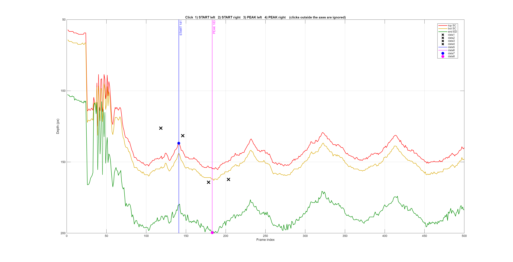
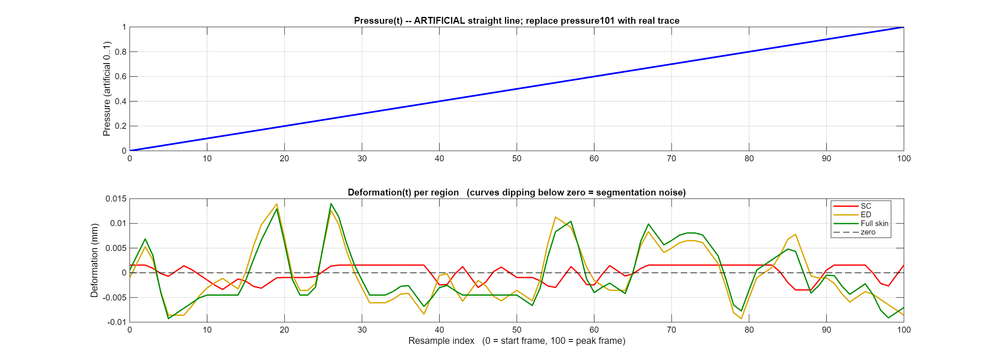
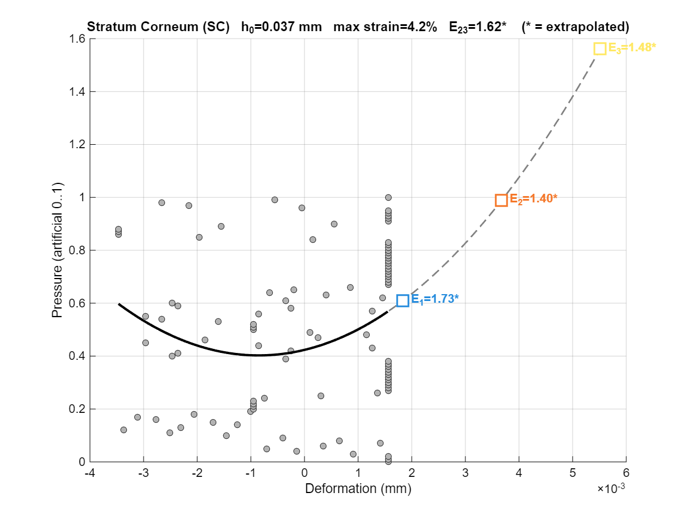
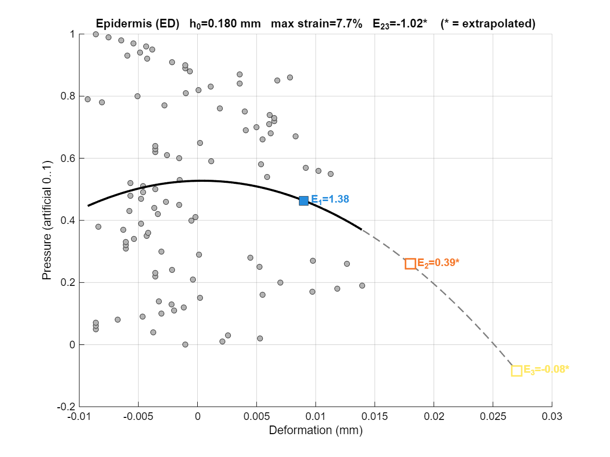
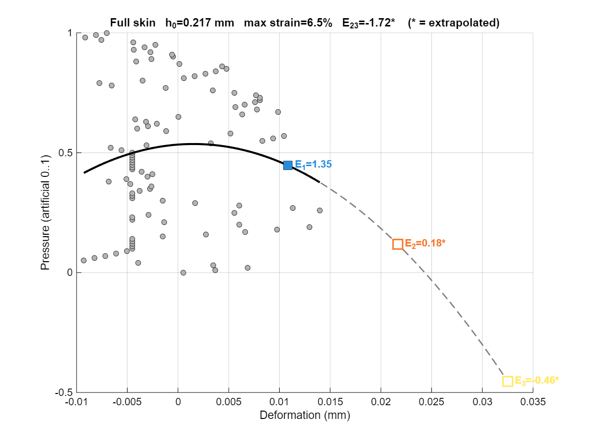
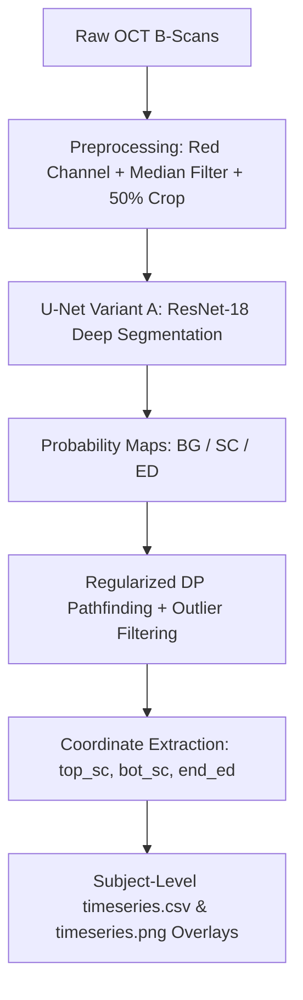

# OCT Skin Layer Analyzer v2.1.0

[](https://www.mathworks.com/products/matlab.html)
[](https://github.com/Corneliox/OCT_Analyzer/releases)
[]()
[]()

> **High-throughput, GPU-accelerated desktop application and automated analysis pipeline for skin optical coherence tomography (OCT) B-scan segmentation, dynamic thickness tracking, and unattended batch processing.**

---

## ✨ What's New in v2.1.0

* 🌲 **Recursive Subject-Level Batch Discovery (`_analysis` Placement):**
  * Select any top/master folder (e.g., grouped by protocol sets or master folders); the batch engine automatically traverses the tree, identifies all subjects (`Sub1`, `Sub2`, etc.), and places each `SubX_analysis/` directory **directly beside each subject folder**.
  * Supports scan folders ending in `_N` or `_N.bin`, keeping intermediate raw `_out` caches untouched.
  * Integrated resume/skip logic: already analyzed conditions are safely skipped on re-runs.
* 🛡️ **Spike-Free Epidermis (`end ED`) Extraction:**
  * Re-engineered Dynamic Programming (DP) pathfinder with enhanced regularization penalty (`\lambda = 1.5 - 2.0`) and reduced jump radius.
  * Multi-stage outlier rejection (Hampel filter + Savitzky-Golay smoothing) eliminates speckle noise traps and vertical impulse glitches across both B-scans and time-series plots.
  * Enforced anatomical non-zero thickness priors ($z_{\text{ED}} \ge z_{\text{bot SC}} + \Delta$).
* 🖥️ **Responsive High-DPI UI (Windows 10 & 11 Compatible):**
  * Replaced rigid absolute positioning with a responsive `uigridlayout`.
  * Seamless scaling on High-DPI monitors (100%, 125%, 150%, 175%) using native Segoe UI typography and auto-expanding log console.

---

## 📂 Supported Directory Structure

```text
Master_OCT_Study/                  <-- [Select this or any parent folder in the App]
├── Subject_01/
│   └── Protocol_A/
│       ├── scan_0.bin/            (contains B-scan frames)
│       ├── scan_0.bin_out/        (segmentation cache)
│       └── scan_1.bin/
├── Subject_01_analysis/           <-- [Generated right beside Subject_01]
│   ├── timeseries.csv
│   └── timeseries.png
│
├── Subject_02/
│   └── Protocol_B/
│       └── scan_0.bin/
├── Subject_02_analysis/           <-- [Generated right beside Subject_02]
│
├── batch_summary.csv              <-- [Overall batch execution report]
└── batch_log.txt                  <-- [Unattended execution log]
```

---

## 📸 Output & Visualizations

| Layer Segmentation & Boundary Tracking | Dynamic Time-Series Analysis |
| :---: | :---: |
|  |  |

| Stratum Corneum (SC) Layer | Epidermis (ED) Layer | Full Skin Thickness |
| :---: | :---: | :---: |
|  |  |  |

---

## 📖 Overview

The **OCT Skin Layer Analyzer** is an automated pipeline designed for skin biomechanics, dermatology, and cosmetic research. It processes multi-frame OCT time-series sequences to accurately segment skin layers and dynamically track layer thickness changes over time (e.g., during mechanical stimulation, hydration, or topical treatments).

### Key Tracked Boundaries
1. 🔴 **Red Boundary (`top SC`):** Top surface of the **Stratum Corneum** (skin surface interface).
2. 🟡 **Yellow Boundary (`bot SC`):** Boundary between the **Stratum Corneum** and viable **Epidermis**.
3. 🟢 **Green Boundary (`end ED`):** Dermal-Epidermal Junction (**DEJ**) separating the **Epidermis** from the **Dermis**.

### Measured Quantitative Outputs:
* **Stratum Corneum (SC) Thickness** (mm / px)
* **Epidermis (ED) Thickness** (mm / px)
* **Total Skin Thickness** (mm / px)
* **Surface Displacement** (mm / px)

---

## ⚡ Performance Optimizations

This optimized release includes high-throughput algorithmic enhancements tuned for 4 GB VRAM GPUs:

* 🚀 **GPU Mini-Batching:** Groups incoming frames into multi-image batches (`BatchSize = 8`) to maximize GPU tensor core concurrency, dramatically lowering seconds-per-frame inference time.
* ⚡ **Vectorized Dynamic Programming (DP):** Eliminated nested pixel-by-pixel loops in the line-tracing algorithm. Replaced 512+ row iterations with single-instruction 1D min-convolution matrix shifts, reducing CPU pathfinding runtime by over **85%**.
* 🛡️ **Speckle-Preserving Preprocessing:** Uses a symmetric 2D median filter (`medfilt2`) on the dominant red color channel, stripping high-frequency OCT speckle noise without blurring sharp structural layer boundaries.

---

## 🔄 Pipeline Architecture



---

## 📥 Download & Installation

### Option 1: Standalone Installers (No MATLAB Required)
Pre-built packages are available on the [**Releases Page**](https://github.com/Corneliox/OCT_Analyzer/releases):

* **Windows:** Download and run `OCTAnalyzer_OptimizedInstaller.exe`.
* **Linux (Ubuntu / Debian / CentOS):** Download `OCTAnalyzer_Optimized_Linux_x86_64.tar.gz`, extract, and execute:
  ```bash
  tar -xzf OCTAnalyzer_Optimized_Linux_x86_64.tar.gz
  ./run_OCTAnalyzer_Optimized.sh <MATLAB_Runtime_Path>
  ```

---

### Option 2: Running in MATLAB (Cross-Platform: Windows, Linux, macOS)
1. Clone the repository:
   ```bash
   git clone https://github.com/Corneliox/OCT_Analyzer.git
   cd OCT_Analyzer
   ```
2. Open MATLAB and run the graphical interface:
   ```matlab
   OCTAnalyzerApp
   ```

---

## 📁 Repository Structure

```text
├── docs/images/                # Documentation figures and result screenshots
├── trained_variantA/
│   └── unet_variantA_*.mat     # Trained ResNet-18 U-Net deep learning weights
├── OCTAnalyzerApp.m            # Desktop Graphical User Interface (GUI)
├── batch_analyze_tree.m        # Recursive multi-condition directory batch processor
├── analyze_stimulation_run.m   # Time-series analysis, metrics computation, and PNG plotting
├── segment_new_images.m        # GPU-batched neural network inference engine
├── extract_boundaries_dp.m     # Vectorized dynamic programming boundary extractor
├── preprocess_image_only.m     # Denoising and image preparation filter
├── compile_oct_app_installer.m # Cross-platform standalone installer compiler script
└── .gitignore                  # Git exclude rules for outputs, logs, and temp binaries
```

---

## 📄 License & Attribution
Developed for OCT image processing and skin biomechanics research.
Available under the Academic Research License.
