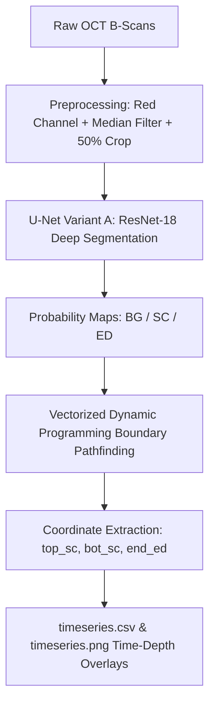

# OCT Skin Layer Analyzer

[](https://github.com/Corneliox/OCT_Analyzer/actions/workflows/build.yml)
[](https://www.mathworks.com/products/matlab.html)
[]()
[]()

> **High-throughput, GPU-accelerated desktop application and analysis pipeline for automated segmentation and dynamic thickness tracking of human skin optical coherence tomography (OCT) B-scans.**

---

## 📖 Overview

The **OCT Skin Layer Analyzer** is an automated pipeline designed for skin biomechanics and dermatology research. It processes large, multi-frame OCT time-series data to accurately identify anatomical skin layers and dynamically track layer thickness changes over time (e.g., during mechanical stimulation, hydration, or topical treatments).

### Key Tracked Boundaries & Layers
1. **Red Boundary (`top SC`):** Top surface of the **Stratum Corneum** (skin-to-air interface).
2. **Yellow Boundary (`bot SC`):** Interface between the **Stratum Corneum** and viable **Epidermis**.
3. **Green Boundary (`end ED`):** Dermal-Epidermal Junction (**DEJ**) separating the **Epidermis** from the **Dermis**.

From these boundaries, the pipeline outputs continuous physical measurements (in millimeters or pixels) for:
* **Stratum Corneum (SC) Thickness**
* **Epidermis (ED) Thickness**
* **Total Skin Thickness**
* **Surface Displacement**

---

## ⚡ Performance Optimizations

This version includes high-throughput algorithmic enhancements tuned for desktop and workstation GPUs (with a 4 GB VRAM baseline):

* 🚀 **GPU Mini-Batching:** Decoupled image I/O from inference and feeds multi-frame batches (default `BatchSize = 8`) to the deep neural network simultaneously, maximizing GPU tensor core utilization.
* ⚡ **Vectorized Dynamic Programming (DP):** Eliminated nested pixel-by-pixel loops in the line-tracing algorithm. Replaced 512+ row iterations with single-instruction 1D min-convolution matrix shifts, reducing CPU pathfinding runtime by over **85%**.
* 🛡️ ** speckle-Preserving Preprocessing:** Uses a symmetric 2D median filter (`medfilt2`) on the dominant red color channel, filtering high-frequency OCT speckle noise without blurring sharp structural layer boundaries.

---

## 🔄 End-to-End Workflow



1. **Batch Folder Crawler (`batch_analyze_tree.m`):** Recursively walks through user-specified directory trees to discover scan condition folders (ending in `_N`). Automatically resumes and skips already completed folders.
2. **Preprocessing (`preprocess_image_only.m`):** Isolates the high-contrast channel, applies symmetric noise filtering, and crops redundant background tissue.
3. **AI Inference (`segment_new_images.m`):** Feeds batched images into a trained U-Net (ResNet-18 encoder) to generate pixel-level class probability distributions.
4. **Boundary Optimization (`extract_boundaries_dp.m`):** Solves energy-minimization path equations with jump and monotonicity penalties ($top \le bot \le end$) to extract smooth, physiologically accurate boundaries.
5. **Statistical Synthesis (`analyze_stimulation_run.m`):** Converts pixel depths to metric thickness using the user-defined `PxPerMm` scale, generating structured CSV datasets and publication-ready time-depth visualization graphs.

---

## 🖥️ Graphical User Interface (GUI)

The standalone desktop app (`OCTAnalyzerApp.m`) provides an intuitive workflow:
1. Click **Browse** and select the top-level parent folder containing subject or experimental scan subfolders.
2. Set the resolution scale (**Pixels per mm**, default `200`).
3. Click **Run Analysis**. The console displays live per-frame progress, batch completion status, and processing speeds (`s/image`).

---

## 📁 Repository Structure

```text
├── .github/workflows/
│   └── build.yml               # Multi-OS CI/CD matrix (Windows, Linux, macOS ARM & Intel)
├── trained_variantA/
│   └── unet_variantA_*.mat     # Trained ResNet-18 U-Net deep learning model weights
├── OCTAnalyzerApp.m            # Graphical desktop user interface (MATLAB App Designer)
├── batch_analyze_tree.m        # Recursive multi-condition directory batch processor
├── analyze_stimulation_run.m   # Time-series analysis, metrics computation, and PNG plotting
├── segment_new_images.m        # GPU-batched neural network inference engine
├── extract_boundaries_dp.m     # Vectorized dynamic programming boundary extractor
├── preprocess_image_only.m     # Denoising and image preparation filter
├── compile_oct_app_installer.m # Cross-platform standalone installer compiler script
└── .gitignore                  # Git exclude rules for outputs, logs, and temp binaries
```

---

## 🚀 Building & Installing

### 1. Running in MATLAB
Ensure MATLAB R2024b or newer is installed with:
* *Deep Learning Toolbox*
* *Image Processing Toolbox*
* *Parallel Computing Toolbox* (optional, for multi-core acceleration)

Launch the application:
```matlab
OCTAnalyzerApp
```

### 2. Compiling Standalone Installers Locally
To compile the standalone installer that runs on systems without MATLAB:
```matlab
compile_oct_app_installer
```
The resulting installer package will be output to `OCTAnalyzer_installer/installer/`.

### 3. Automated Cross-Platform Builds (GitHub Actions)
This repository includes a multi-platform CI/CD workflow building across:
* **Windows** (`windows-latest`) $\rightarrow$ `.exe` installer
* **Ubuntu Linux** (`ubuntu-latest`) $\rightarrow$ Linux binary package
* **macOS Apple Silicon (ARM)** (`macos-15`) $\rightarrow$ macOS `.app`
* **macOS Intel (x86_64)** (`macos-15-intel`) $\rightarrow$ macOS `.app`

> **CI Licensing Note:** Building with MATLAB Compiler in GitHub Actions requires configuring a `MATHWORKS_TOKEN` or `MLM_LICENSE_FILE` in your GitHub repository secrets (**Settings $\rightarrow$ Secrets and variables $\rightarrow$ Actions**). Pre-compiled release packages are available under the [Releases](https://github.com/Corneliox/OCT_Analyzer/releases) tab.

---

## 📄 License & Attribution
Developed for OCT image processing and skin biomechanics research.
Available under the Academic Research License.
